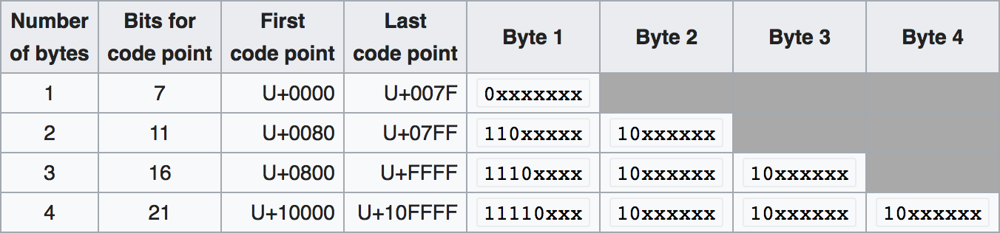
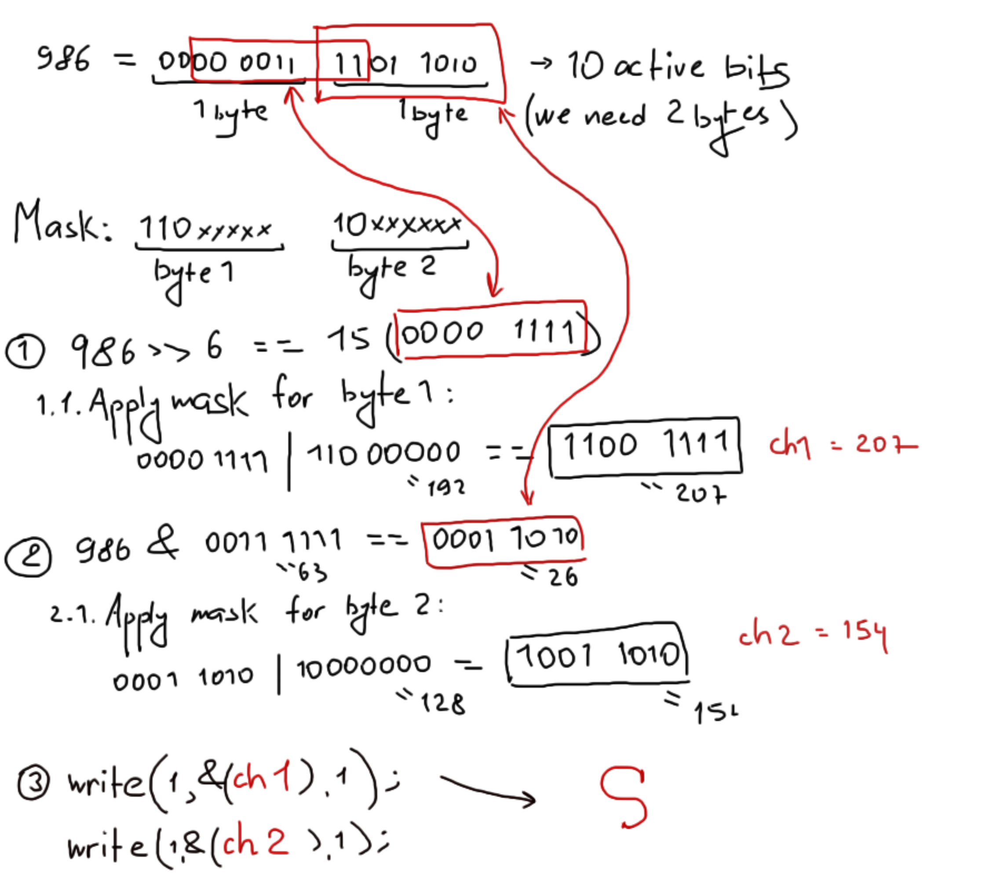
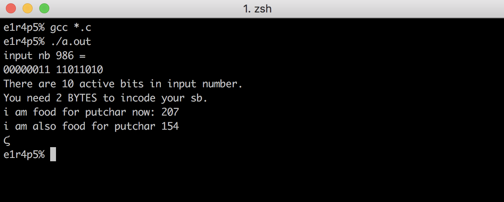
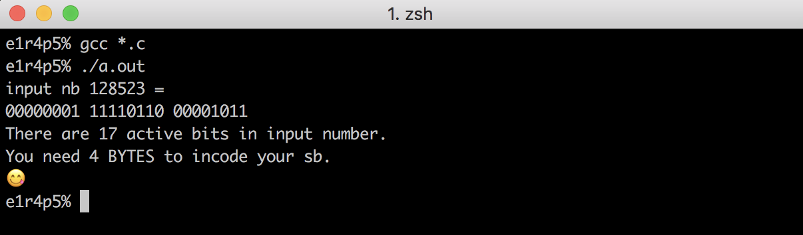

## How do i understand the idea of the UNICODE:
ASCII table was developed to encode characters whose codes can be placed in 7 bits (128 characters, 27 = 128);
the highest 7th bit (the numbering starts from zero) was used to control errors that occurred during data transmission.
Than the encoding was extended to 256 characters (28 = 256); the codes of the first 128 characters have not changed.
**Thus, in 1 byte, which consists of 8 bits, you can put the maximum possible number - 255 ``(255(dec) = 1 1 1 1 1 1 1 1(binary))``.**
Therefore, to encode a symbol with a serial number, for example, 1200(dec), you need more bytes. This is the  main idea of Unicode!
### The coding algorithm in UTF-8 standardization consists of 3 stages[[WIKI](https://ru.wikipedia.org/wiki/UTF-8)]: 
#### 1. Determine the number of octets (bytes) required to encode a character. The character number is taken from the Unicode standard[[Unicode characters table](https://unicode-table.com/ru/#sundanese)].

For example, let's encode the Greek Letter Stigma with Unicode number U+03DA(hex) = 986(dec).
##### 1.1 Let's look at this number in binary representation and calculate the number of active bits:


>986 (int) == 00000011 11011010 

to count the number of active bits let's use the bitwise right shift by 1 bit:
```С
#include "unicode.h"

int count_active_bits(int c_uni)
{
	int count_b;

	count_b = 0;
	while (c_uni)
	{
		c_uni = c_uni >> 1;
		count_b++;
	}
	return (count_b);
}

int main(void)
{
    int     c_uni;
    int 	bits_amt;

    c_uni = 986;
    bits_amt = count_active_bits(c_uni);
    printf("There are %d bits in input number.\n", bits_amt);
    return (0);
}
```
the input is:
> There are 10 bits in input number.
##### 1.2. Now we have to decide how many bytes we need to encode our concrete symbol.
if bits_amount <= 7 ONE byte will be enough; if bits_amount > 7 && bits_amount <= 11 we need 
TWO bytes; if bits_amount > 11 && bits_amount <= 16 we need THREE bytes for encoding;
and if bits_amount more then 16 we need 4 bytes.

```C
int		decide_about_bytes(int bits_amount)
{
	if (bits_amount <= 7)
		return (1);
	else if (bits_amount > 7 && bits_amount <= 11)
		return (2);
	else if (bits_amount > 11 && bits_amount <= 16)
		return (3);
	else if (bits_amount > 16)
		return (4);
	else
		return (0);
}
```
the program says:
> You need 2 BYTES to incode your sb.

and she's right, because ``986 (int) == 00000011 11011010 == 2 bytes``

In accordance with how many bytes are needed to encode a symbol, the corresponding algorithm is called
(if the character takes 1 byte, then this is an ASCII-symbol, just output it to the console with the help of putchar()):

```С
if (how_much_bytes == 1)
		ft_putchar((char)c_uni);
	else if (how_much_bytes == 2)
		if_2_bytes(box);
	else if (how_much_bytes == 3)
		if_3_bytes(box);
	else if (how_much_bytes == 4)
		if_4_bytes(box);
```
our symbol takes 2 bytes, so we slowly approached the second step.
#### 2. Set the high-order bits of the first octet in accordance with the required number of octets, determined in the first stage:

Let's create bit masks according to the table:


this is from my .h file:
```C
#define TWO_BYTES_F 	192        /* == 1100 0000 */
#define THREE_BYTES_F 	224        /* == 1110 0000 */
#define FOUR_BYTES_F 	240        /* == 1111 0000 */
#define REST_BYTES 		128

#define SIX_UNITS		63         /* == 0011 1111 */
#define TWELVE_UNITS	4095       /* == 00001111 11111111 */

#define SIX_U_HEAD_FOUR_B 258048   /* == 00000011 11110000 00000000 */
#define SIX_U_MID_FOUR_B 4032      /* == 00001111 11000000 */
```
#### 3. Set significant octet bits according to the Unicode character number, expressed in binary form. Start filling with the lower bits of the character number, putting them in the least significant bits of the last octet, continue from right to left until the first octet. Free bits of the first octet, left unused, filled with zeros.
my explanations are **comments** and picture below:
```C
void if_2_bytes(int c_uni)
{
	int c;
	int char_1;
	int char_2;
	
	/* we are starting from the most significant byte (the most LEFT one);
	we need to throw right byte away - let's use bit shift on 6 units right */
	
	c = c_uni;
	c = c >> 6;

	
	/* now we need to apply BITMASK for 2-bytes representation of sb for lead byte;
	using logical OR for this:*/
	
	c = c | TWO_BYTES_F;
	char_1 = c;
	printf("i am food for putchar now: %d\n", char_1);
	
	/* Now we need to apply the corresponding mask to the low-order byte;
	get the low byte using the properties of the logical AND (00111111 = 63)*/
	
	c = >c_uni;
	c = c & SIX_UNITS;
	c = c | REST_BYTES;
	char_2 = c;

	printf("i am also food for putchar %d\n", char_2);
	write(1, &(char_1), 1);
	write(1, &(char_2), 1);
}
```

For more bytes, everything happens by analogy. To see our Stigma, download UNICODE_autonomous folder and follow this:

or for 4-bytes symbol:

 view code here: [ft_printf/UNICODE_autonomous/](https://github.com/KseniiaPrytkova/ft_printf/tree/master/UNICODE_autonomous)

#### Links
* [What Every Programmer Absolutely, Positively Needs To Know About Encodings And Character Sets To Work With Text](http://kunststube.net/encoding/)
* [Bitwise operation](https://en.wikipedia.org/wiki/Bitwise_operation)
* [UTF-8](https://ru.wikipedia.org/wiki/UTF-8)
* [Юникод](https://ru.wikipedia.org/wiki/%D0%AE%D0%BD%D0%B8%D0%BA%D0%BE%D0%B4)

